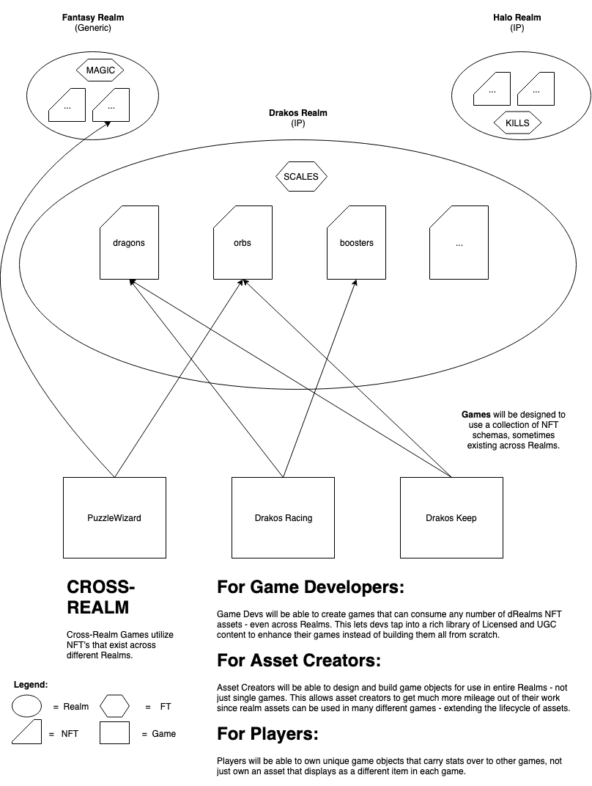

# dRealms v0.2.0 Proposed Update

## Current Design:

Currently, every version of a game asset is represented as a license. A single NFT can have multiple licenses, meaning one game asset can have many different representations depending on the game being played - but licenses never share any data with one another, so any progress made in one game doesn't carry over into another game even though a player may be using the same NFT. This means you are effectively only owning a *collection* of game assets that share nothing in common except an arbitrary serial number on-chain. In some cases this is desireable, but overall it doesn't lean into the dRealms vision that games assets should carry between games.

## Proposed Change:

In order for players to feel like their progress and achievements truly carry between games, there needs to be a shared stat block that all games (who own a license for the token) may write to. This has to be done strategically though, since stats are shared by multiple games they must all adhere to the same rules when updating stat blocks; in other words, a player's progress in one game shouldn't conflict with progress made in another game - they should be complimentary.

### Code:

```
map<name, uint32_t> stats; //stat block in an NFT

ACTION addstat() //adds a stat to the stat block

ACTION awardexp(); //called by licensed games to award an NFT with EXP

ACTION levelup(); //called by the NFT owner to spend earned EXP to level up asset.

ACTION spendpoint(); //spends an available point on a stat to upgrade it
```

#### Could also have:
```
map<name, name> skills; //denotes skill names earned by NFT

map<name, bool> qualities; //denotes true or false characteristics about the NFT
```

Games could also choose to use their own token for the purposed of levelling up. i.e. SCALES for the Drakos Realm, MAGIC for Fantasy, KILLS for Halo, etc. 

Could also have `drealmsnexus` create a global EXP token and sell/grant/whatever the tokens to propective developers. EXP tokens would never be tradeable or sellable, but are instead *awardable* for playing games. This would drive a demand for EXP as a "resource" that is distributed to players through gameplay.

### Example:

Player 1 loads up Drakos Keep and is given a newly minted `dragon` NFT (Serial #7). This NFT starts at Level 1 with 0 EXP. Player 1 plays a few games with their dragon and the game server calls `awardexp(500 EXP, readyplayer1, dragon, 7)` which awards 500 EXP to Dragon NFT #7. Player 1 then calls `levelup()` on the contract, which burns the 100 EXP needed to grow the NFT from Level 1 -> 2, and leaving Dragon #7 with 400 EXP.

Player 1 then downloads the new Drakos Racing game, which was built to use the existing `dragon` NFTs and their pre-defined stat blocks. Upon loading up the game and signing in with their Telos account, the game sees that Player 1 owns Dragon #7 and loads the asset into the game. Player 1 is now playing Drakos Racing with their Level 2 Dragon NFT they earned from Drakos Keep. Any progress earned from (*awarded by*) the Drakos Racing game will automatically be applied to Player 1's Dragon. Player 1 can then spend those earned experience to level up the dragon and get a new stat point (or sell it on a marketplace with the experience, letting the purchasing player decide how they want to level up the token).

The same scenario could play out in the reverse as well, Player 1 could have started with Drakos Racing and earned a dragon through that game and then brought it into Drakos Keep.


